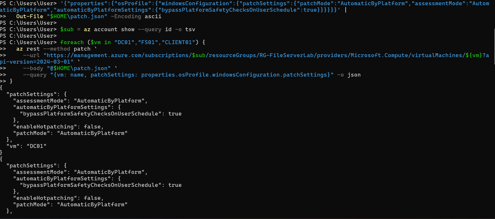
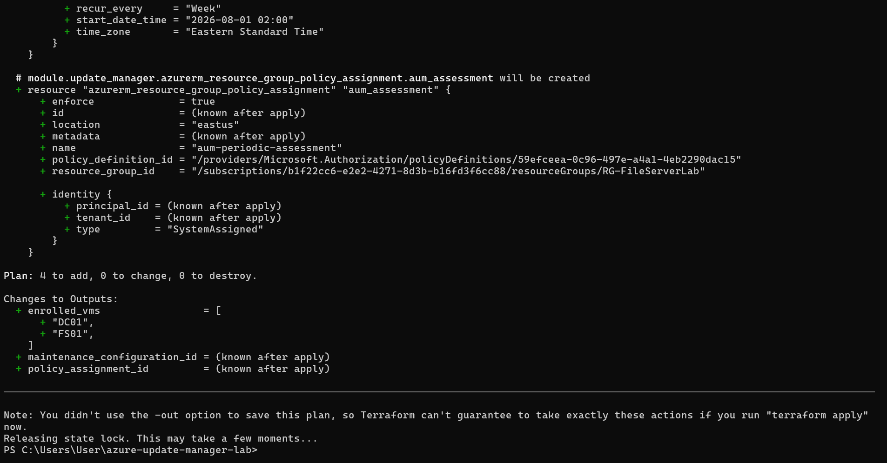
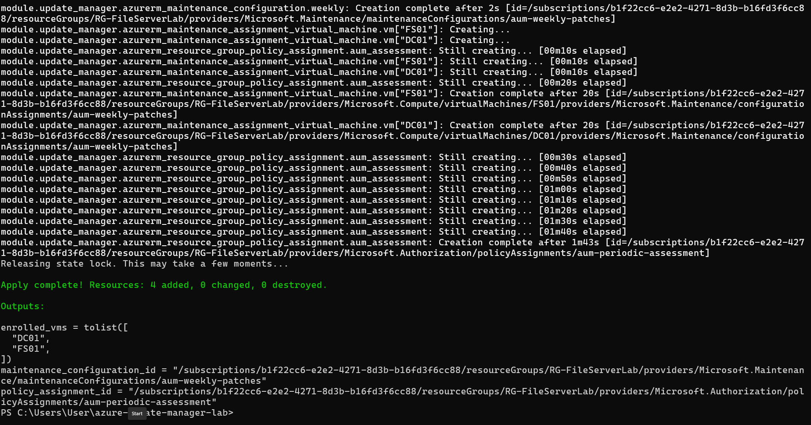
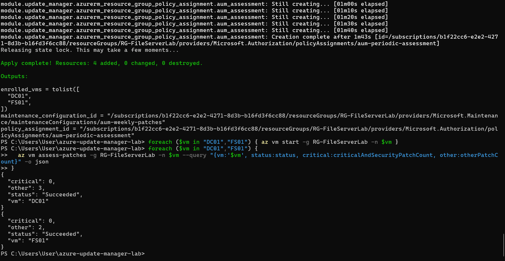
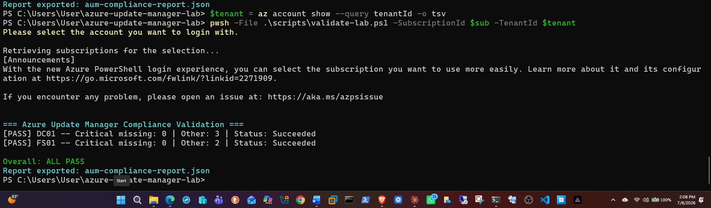
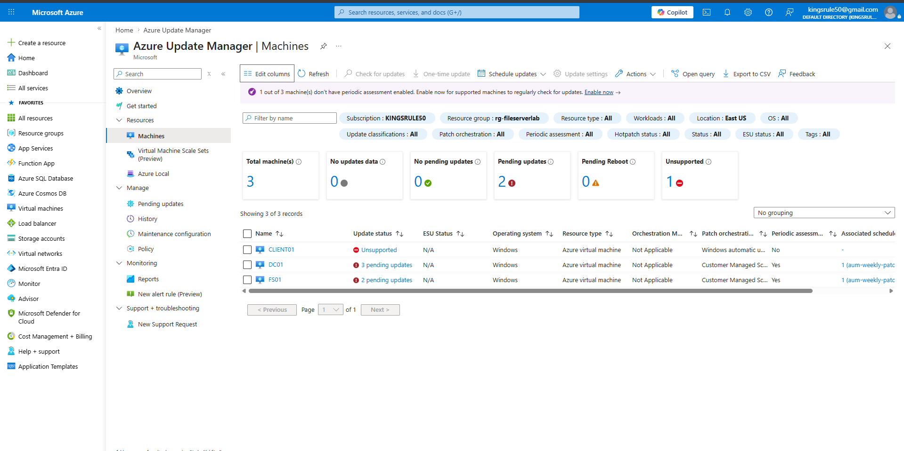
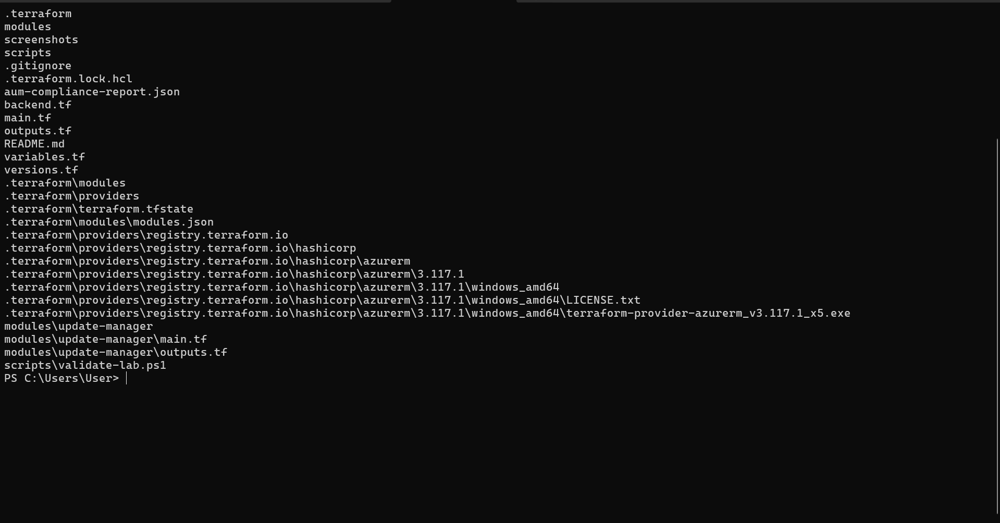
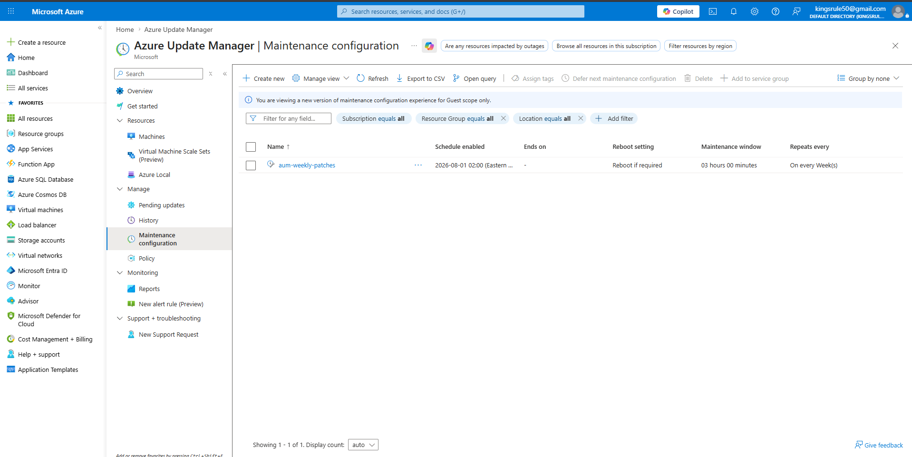
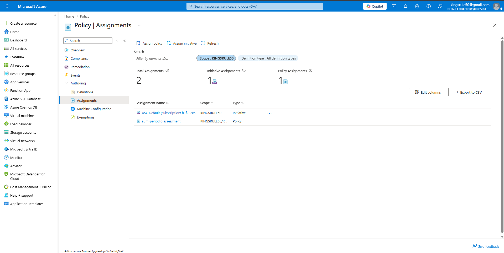

# Azure Update Manager — Patch Management & Compliance Reporting

**Enterprise Azure Infrastructure Automation series** — policy-based patch assessment, a scheduled maintenance window, and automated compliance reporting, deployed with modular Terraform onto my existing Azure infrastructure and validated end-to-end with PowerShell.

**Stack:** Terraform (azurerm) · Azure Update Manager · Azure Policy · ARM REST API · PowerShell 7 (Az module) · Azure CLI

---

## 💼 The Business Problem

Unpatched systems are one of the most common root causes of security incidents. The challenge at scale is not patching one server — it is knowing which machines across an environment are missing which patches, enforcing a consistent patch schedule, and producing documentation that proves compliance to auditors.

The real-world scenario this project implements: a new CVE drops with a CVSS score of 9.8. The security team asks *which of our servers are missing the patch?* The ops engineer triggers an on-demand assessment across the fleet, pulls a compliance report within minutes, and affected machines are patched in the next approved maintenance window. Automated, documented, auditable.

## 🛠️ Problems I Solved

| Problem | Solution I Implemented |
| ------- | ---------------------- |
| Manual per-VM patch enrollment doesn't scale | I assigned Azure Policy `59efceea` at the resource-group scope so every VM — including future ones — is auto-enrolled into periodic patch assessment |
| Patches applied at unpredictable times cause unplanned outages | I defined a Maintenance Configuration as code: weekly Saturday 02:00 ET window, 3-hour duration, Critical/Security/UpdateRollup only, reboot only if required |
| Assessment and patching are separate operations in Azure — enrolling a VM for assessment does NOT patch it | I created Maintenance Assignments linking each server to the weekly window, completing both halves of the pipeline |
| The Update Manager layer had to be added **without touching the existing production-style infrastructure** | I used Terraform data sources to read the existing VMs and resource group — two isolated state files share infrastructure with zero conflict, and `terraform destroy` removes only what this project owns |
| Existing VMs predated the patch-orchestration requirements and `az vm update --set` cannot create the nested `automaticByPlatformSettings` object | I patched the VM models directly through the ARM REST API with `az rest --method patch` |
| A Windows client VM (CLIENT01) is not supported by Azure VM guest patching | I scoped it out of the maintenance assignments and documented the boundary: server fleets belong to Update Manager, client fleets belong to Intune/Autopatch |
| Auditors and downstream systems need machine-readable evidence, not portal screenshots | I wrote `validate-lab.ps1` — queries per-VM assessment state, prints PASS/FAIL, and exports a JSON report a SIEM or ServiceNow integration can consume |

## 🏗️ What I Built

This project layers a complete patch management pipeline onto the infrastructure from my [ntfs-lab-terraform](https://github.com/kingsrule50/ntfs-lab-terraform) deployment (DC01 domain controller, FS01 file server) — without modifying or redeploying any of it.

```
azure-update-manager-lab/
├── backend.tf                        # Remote state — shared storage account, isolated state key
├── versions.tf
├── variables.tf
├── main.tf                           # Data sources for existing VMs + module wiring
├── outputs.tf
├── modules/
│   └── update-manager/main.tf        # Azure Policy + Maintenance Config + Assignments
└── scripts/
    └── validate-lab.ps1              # Compliance validation + JSON report export
```

## 📋 Implementation Walkthrough

### 1 — I prepared the existing VMs for scheduled patching via the ARM REST API

Scheduled patching requires `patchMode = AutomaticByPlatform` with `bypassPlatformSafetyChecksOnUserSchedule = true`. The CLI's `--set` cannot create the nested settings object on an existing VM model, so I sent a PATCH request straight to the Compute API. This is also where CLIENT01 surfaced the client-OS limitation (`InvalidParameter: The selected VM image is not supported`) — expected behavior, documented and scoped out.



### 2 — I deployed the Update Manager layer with modular Terraform

Four resources, zero changes to existing infrastructure — the plan proves the data-source approach reads without modifying:



One deviation from standard references: policy definition `59efceea` has a *Modify* effect, so I added a system-assigned managed identity and location to the assignment — without them, the apply fails.



### 3 — I triggered an on-demand assessment across the fleet

This is the CVE-response move: instead of waiting for the ~24h scheduled assessment cycle, I forced an immediate scan on both servers.



### 4 — I validated compliance and exported the audit artifact

The reference script called `Get-AzVMPatchAssessmentResult`, which does not exist in Az.Compute — I debugged it against the actual module and rebuilt it on `(Get-AzVM -Status).PatchStatus.AvailablePatchSummary`.



The exported report — the artifact a SIEM, ServiceNow, or compliance dashboard would ingest:

```json
{
  "GeneratedAt": "2026-07-08T14:07:11.4563760-04:00",
  "ResourceGroup": "RG-FileServerLab",
  "VMs": [
    {
      "VMName": "DC01",
      "AssessmentStatus": "Succeeded",
      "CriticalAndSecurityCount": 0,
      "OtherPatchCount": 3,
      "LastAssessmentTime": "2026-07-08T17:59:08.5535941Z",
      "Compliant": true,
      "Result": "PASS"
    },
    {
      "VMName": "FS01",
      "AssessmentStatus": "Succeeded",
      "CriticalAndSecurityCount": 0,
      "OtherPatchCount": 2,
      "LastAssessmentTime": "2026-07-08T18:00:11.530212Z",
      "Compliant": true,
      "Result": "PASS"
    }
  ]
}
```

### 5 — I verified everything in the Azure portal

Both servers enrolled with the weekly schedule associated; CLIENT01 correctly reported as *Unsupported*:



The fleet-wide compliance dashboard:



The maintenance window as a business contract — schedule, duration, reboot behavior:



Policy-based enrollment scoped to the resource group:



## 🚀 Run It

```powershell
# Prerequisites: Terraform >= 1.5, Azure CLI, PowerShell 7 + Az module
az provider register --namespace Microsoft.Maintenance
az provider register --namespace Microsoft.GuestConfiguration

terraform init
terraform plan
terraform apply

# Trigger on-demand assessment (VMs must be running)
foreach ($vm in "DC01","FS01") { az vm assess-patches -g RG-FileServerLab -n $vm }

# Validate and export the compliance report
pwsh -File .\scripts\validate-lab.ps1 -SubscriptionId <sub-id> -TenantId <tenant-id>

# Teardown — removes ONLY the 4 Update Manager resources; existing VMs untouched
terraform destroy
```

## 🎯 Skills Demonstrated

| Category | What this project shows |
| -------- | ----------------------- |
| Infrastructure as Code | Modular Terraform against existing infrastructure — data sources, remote state isolation, surgical destroy scope |
| Governance at Scale | Azure Policy for automatic enrollment — define the rule once, every current and future VM complies |
| Patch Management Design | Maintenance windows with classifications, reboot behavior, and scheduling as a documented business contract |
| API-Level Operations | ARM REST API for VM model changes the CLI cannot express |
| Compliance Automation | PowerShell validation with human-readable output and machine-readable JSON export |
| Real-World Debugging | Diagnosed a nonexistent cmdlet in reference documentation and rebuilt against actual Az module behavior; handled unsupported-OS constraints |
